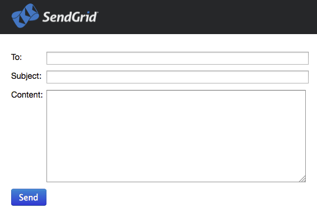

SendGrid Python Django Sample App
=================================

This git repository helps you to send emails quickly and easily through SendGrid using Python and Django.

Create an SendGrid account at http://sendgrid.com/transactional-email/pricing

Clone SendGrid application on your local machine

    git clone https://github.com/sendgrid/sendgrid-python-django-sample-app.git

###Configuration###

Install SendGrid library

    pip install sendgrid==0.3.1

Configure `SGapp/settings.py` file with your information:

Update the *&lt;sendgrid_username&gt;* and *&lt;sendgrid_password&gt;* with your SendGrid credentials.

    SENDGRID_USERNAME = '<sendgrid_username>';
    SENDGRID_PASSWORD = '<sendgrid_password>';

Start python server

    python manage.py runserver
    # or
    python manage.py runserver 0.0.0.0:8000
    
Open the sample application in your browser http://localhost:8000/

For more information you can visit our [Python Library](https://github.com/sendgrid/sendgrid-python)